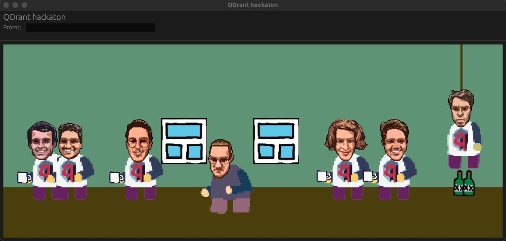
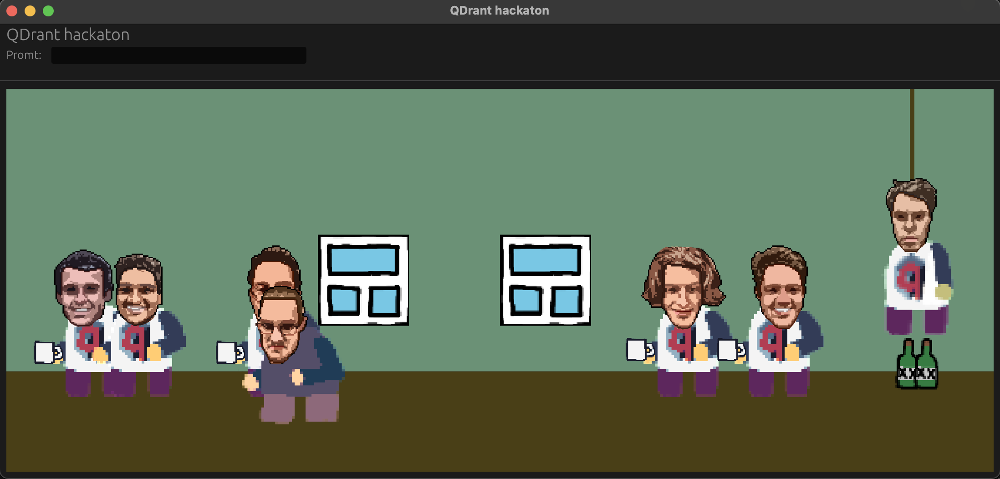
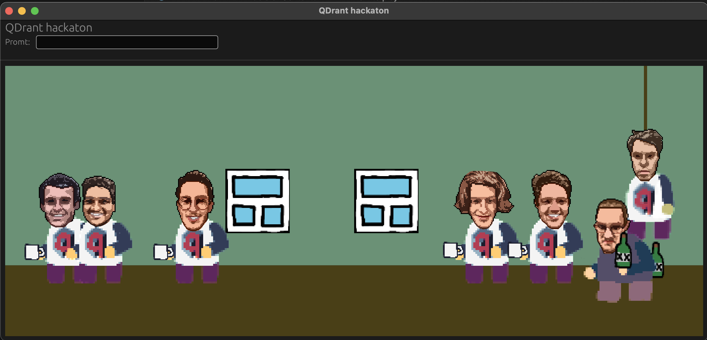
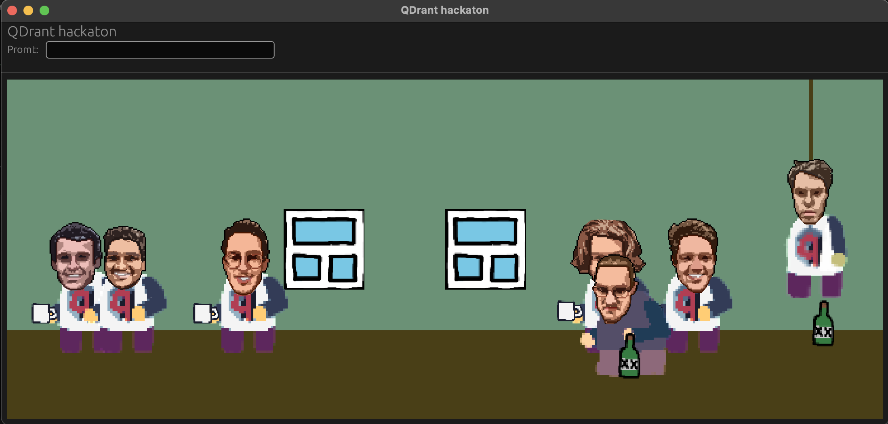
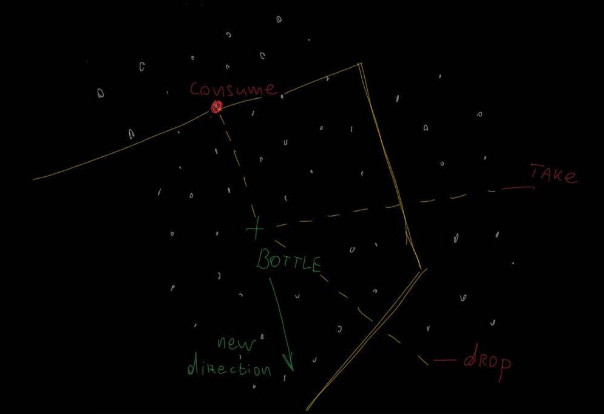

# QDrant 2023 Hackaton

This is a repository for QDrant 2023 Hackaton crated by [Ivan Pleshkov](https://https://github.com/IvanPleshkov).

# Table of Contents
1. [Project description](#Project-description)
2. [How to play](#How-to-play)
3. [How it works](#How-it-works)
4. [Define issue for real qdrant usage](#Define-issue-for-real-qdrant-usage)
5. [Using discovery search to analyse players promts](#Using-discovery-search-to-analyse-players-promts)
6. [Conclusion](#Conclusion)

## Project description

This project presents a simple quest game where player can use text promts to interact with the game. Screenshot:



The main idea of this project is to use QDrant to analyse players promts and find out what they are looking for in the game. More details about this idea you can find in [Define issue for real qdrant usage](#Define-issue-for-real-qdrant-usage) section.

To build and run this project you need first to install [Rust](https://www.rust-lang.org/tools/install). And then, in the project directory, run:

```bash
cargo run --release
```

## How to play

Your promts are addressed to Andrey.

Just type your promt in textbox and wait for the result. See the actual action by this promt in logs. Sorry, but there is no any visualisation of the promt recognising result yet.

There are pure amout of actions and no game ending condition.

You can ask andrey to change this postion. For instance, by request `move to Luis` Andrey will go to Luis:



Also, Andrey can grab and drop items. For instance, by request `take bottle` Andrey will grab the bottle:



And by request `give it to Roman` Andrey will drop the bottle near roman:



Also Andrey can take/drop cups. That's it, no more actions here.

## How it works

For this game I used QDrant and [Cohere](https://cohere.ai/) for text embeddings.

Cohere is required for text embeddings generation. Text embedding is a vector representation of the text. It is used to compare texts. For instance, if you have two texts and you want to know how similar they are, you can generate embeddings for them and then compare these embeddings. The more similar texts are, the closer their embeddings are.

For quest game, I generated a lot promts wich describes each possible action in game (like `go left`, `take Luis cup`, `go to somebody`, ect). I generated some about 512 (there are a lot of synonims like `Ivan == Pleshkov` or `Go == Move`) Then I generated embeddings for each promt. And then I used QDrant to find the most similar promt for the player's promt. And then I executed the action from most similar promt.

Is QDrant actually required here? Not sure, it depends on amount of predefined promts. But even in case of 1 million of predefined promts, QDrant cloud is unnecessary. True usage of QDrant powerful comes next.

## Define issue for real qdrant usage

Let's imagine that we are a game designer of such quest. And for next game update we have to improve set of predefined promts. And as game designer, it's important to find what players try to type but got unexepced result. For instance, a lot of users will promt `consume wine from the bottle`. And game designer is interested for such promts, which are far from predefined promts but close to a real possible action.

All user promts are upserted in QDrant cloud.

This repo contains an implementation of such search of "intresting" promts. To run the demo, try command.

```bash
cargo run -- --analysis="./discovery.json"
```

`discovery.json` contains parameters of search:

```json
{
    "entity": "bottle",
    "limit": 5,
    "actions": [
        "go to",
        "take",
        "gift",
        "drop"
    ]
}
```

`entity` is a search topic. In this example, we are looking for some actions with bottle from users history. `actions` describes list of actions what we can already do with entity.

After running, you may get result like that:
```
[2023-12-22T12:02:46Z INFO  app::history_analysis] Use the bottle to trigger a specific quest or event
[2023-12-22T12:02:46Z INFO  app::history_analysis] Swap equipment to optimize each other's abilities
[2023-12-22T12:02:46Z INFO  app::history_analysis] Hide the bottle in a secret location
[2023-12-22T12:02:46Z INFO  app::history_analysis] Use a tool or object to break the glass
[2023-12-22T12:02:47Z INFO  app::history_analysis] Create a cocktail by mixing different drinks
```

All results are non-similar to each other and all of them are related to the bottle (but not phrase `bottle` which is presented in history database). Nice!

I asked ChatGPT for a list of promts for this game and upserted to qdrant, you can find the list in the file `discovery_search_test_promts.txt`. It contains different requests, not only actions with bottle.

## Using discovery search to analyse players promts

To implemets such search, I used new Discovery API feature with context and target. Context pairs have similar positive point - `entity` text from json. Negative - known actions. Target is a some random direction (text embedding from random phrase):


After this search, next proposal has to be far from previous result. So, for the next discovery search add positive-negative using previous search result:



Each iteration add context pair to the next search. And it makes search result closer and closer to `entity` phrase. It gets a clear behaviour: first found phrases may be a garbage and it's reasonable to search while the phrase is not synonym of `entity` phrase. After that, restart search and try with new randomized target.

## Conclusion

For this short period of time I've managed to create a simple quest game where player can use text promts to interact with the game. Also, I've managed to use QDrant to analyse players promts and find out what they are looking for in the game. I think this is a good example of how QDrant can be used in real life. I hope you liked it.
