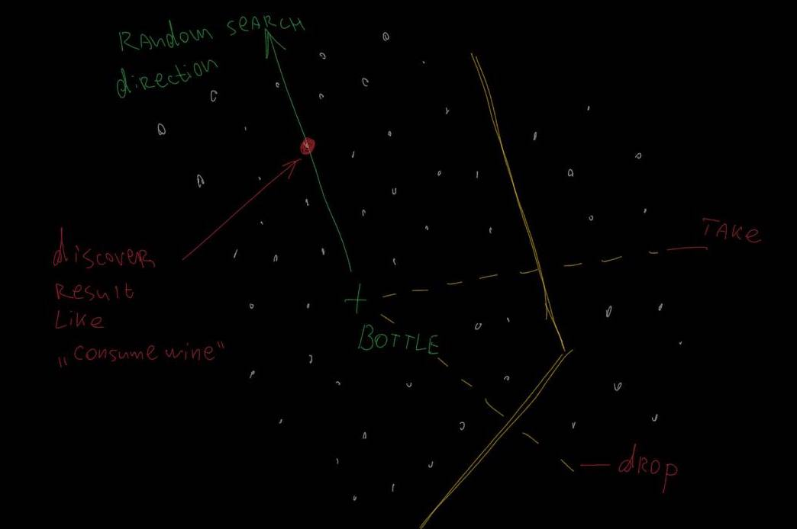

# QDrant 2023 Hackaton

This is a repository for QDrant 2023 Hackaton crated by [Ivan Pleshkov](https://https://github.com/IvanPleshkov).

# Table of Contents
1. [Project description](#Project-description)
2. [How to play](#How-to-play)
3. [How it works](#How-it-works)
4. [Define issue for real qdrant usage](#Define-issue-for-real-qdrant-usage)
5. [Using discovery search to analyse players promts](#Using-discovery-search-to-analyse-players-promts)
6. [Conclusion](#Conclusion)

## Project description

This project presents a simple quest game where player can use text promts to interact with the game. Screenshot:


The main idea of this project is to use QDrant to analyse players promts and find out what they are looking for in the game. More details about this idea you can find in [Define issue for real qdrant usage](#Define-issue-for-real-qdrant-usage) section.

To build and run this project you need first to install [Rust](https://www.rust-lang.org/tools/install). And then, in the project directory, run:

```bash
cargo run --release
```

## How to play

Your promts are addressed to Andrey.

Just type your promt in textbox and wait for the result. See the actual action by this promt in logs. Sorry, but there is no any visualisation of the promt recognising result yet.

There are pure amout of actions and no game ending condition.

You can ask andrey to change this postion. For instance, by request `move to Luis` Andrey will go to Luis:


Also, Andrey can grab and drop items. For instance, by request `take bottle` Andrey will grab the bottle:


And by request `give it to Roman` Andrey will drop the bottle near roman:


Also Andrey can take/drop cups. That's it, no more actions here.

## How it works

For this game I used QDrant and [Cohere](https://cohere.ai/) for text embeddings.

Cohere is required for text embeddings generation. Text embedding is a vector representation of the text. It is used to compare texts. For instance, if you have two texts and you want to know how similar they are, you can generate embeddings for them and then compare these embeddings. The more similar texts are, the closer their embeddings are.

For quest game, I generated a lot promts wich describes each possible action in game (like `go left`, `take Luis cup`, `go to somebody`, ect). I generated some about 512 (there are a lot of synonims like `Ivan == Pleshkov` or `Go == Move`) Then I generated embeddings for each promt. And then I used QDrant to find the most similar promt for the player's promt. And then I executed the action from most similar promt.

## Define issue for real qdrant usage

## Using discovery search to analyse players promts




## Conclusion

For this short period of time I've managed to create a simple quest game where player can use text promts to interact with the game. Also, I've managed to use QDrant to analyse players promts and find out what they are looking for in the game. I think this is a good example of how QDrant can be used in real life. I hope you liked it.
